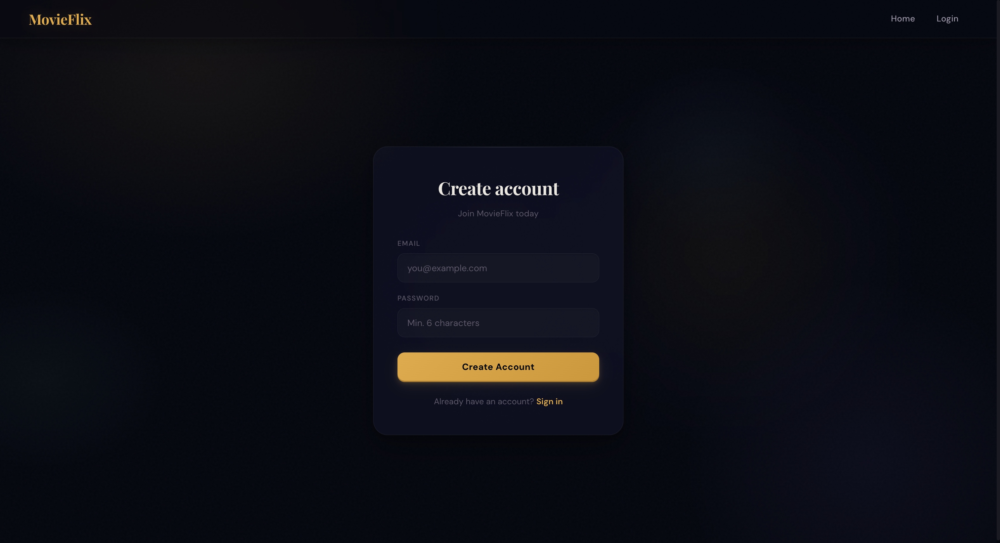
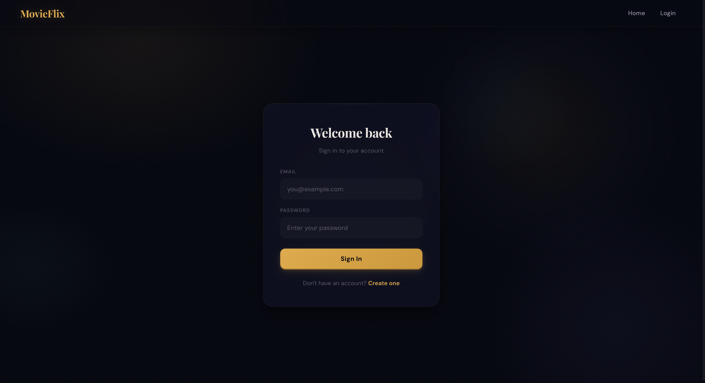
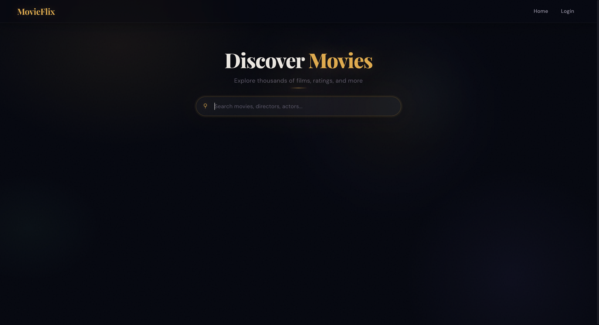
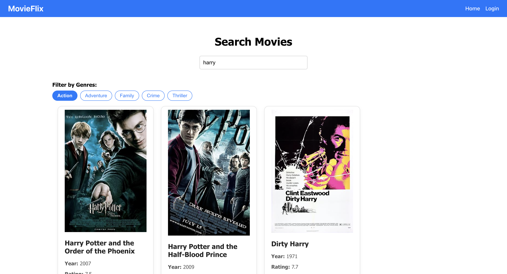
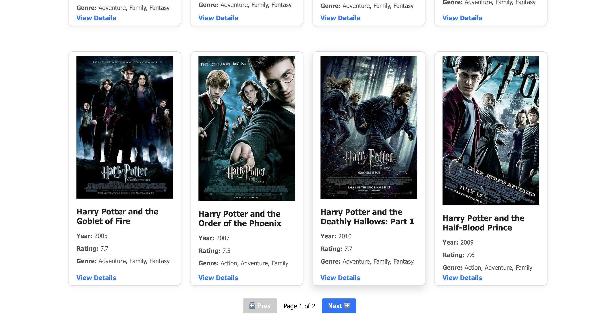
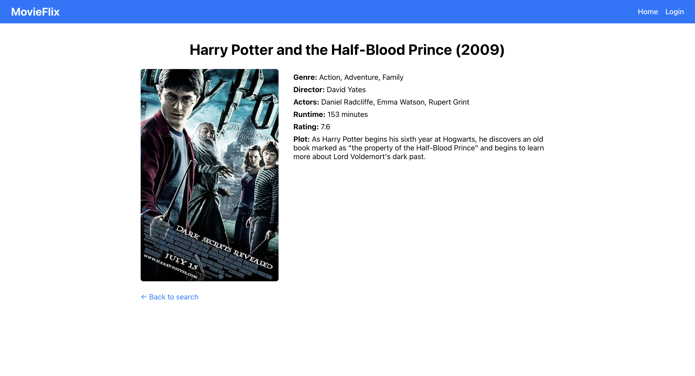

# 🎬 MovieFlix

A full-stack movie search and statistics dashboard application built with the **MERN stack**. Users can search and view detailed information about movies, while admins can access analytics like genre distribution, average ratings, and runtime trends.

---

## 🚀 Features

- 🔍 **Search Movies** using OMDb API
- 🎭 **Filter by Genre**
- ⭐ **Sort by Rating or Year**
- 📊 **Admin Dashboard with Charts** (Genre, Rating, Runtime by Year)
- 🔐 **Authentication with JWT**
- 🧑‍💼 **Admin-only Stats Access**
- 🧠 **Smart Caching** (24-hour cache in MongoDB)

---

## 🛠️ Tech Stack

### Frontend

- React
- React Router
- Axios
- Chart.js
- CSS Modules

### Backend

- Node.js
- Express.js
- MongoDB (Mongoose)
- OMDb API
- JWT Auth
- bcrypt.js

---

### To setup Project. Please check the readme in frontend and backend folder respectively.

From here just clone or download the zip.

---

### Screenshot

- Register Page:
  
- Login Page:
  
- Home Page:
  
- Moive List:
  
  
- Moive Detail:
  
